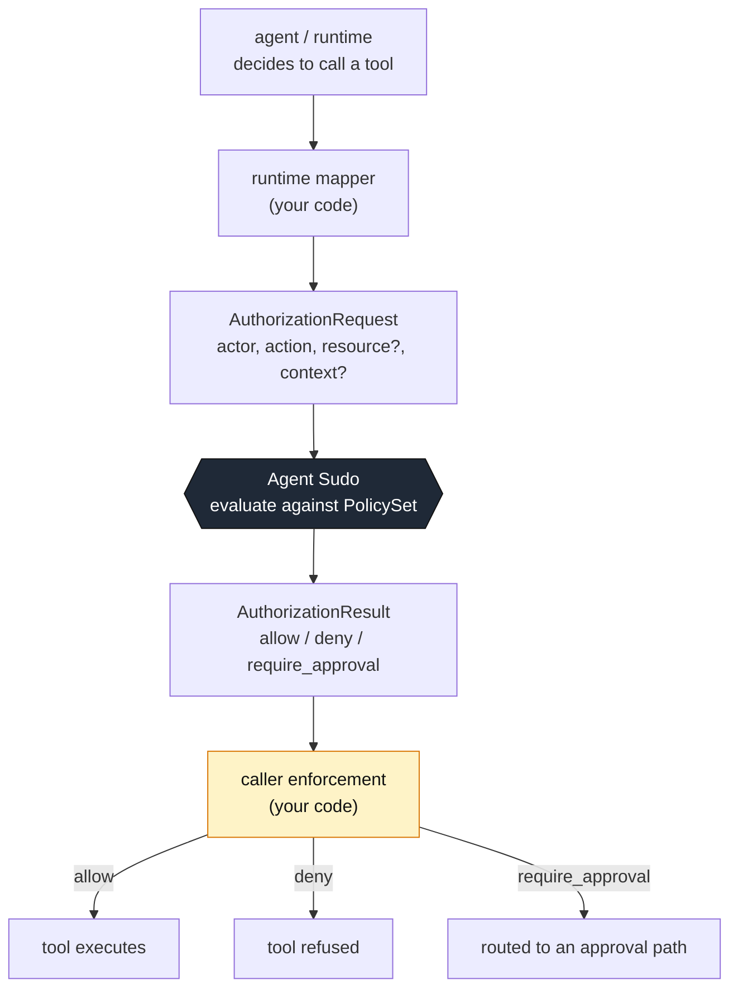
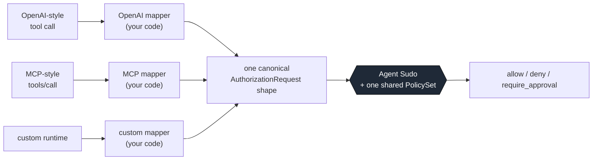

# AI Agent Sudo

**A tiny, provider-neutral authorization checkpoint for AI-agent actions.**

Agent Sudo is a deterministic authorization checkpoint placed immediately before
an AI agent or tool action executes. It answers one question:

> May this **actor** perform this **action**, on this **resource**, in this **context**?

The answer is exactly one of three outcomes:

| decision           | meaning                                                      |
| ------------------ | ----------------------------------------------------------- |
| `allow`            | proceed                                                     |
| `deny`             | do not proceed                                              |
| `require_approval` | do not proceed until a human (or higher authority) approves |

Agent Sudo returns the decision. **It never executes the action**, never calls an
LLM, never touches the network, and never rewrites `require_approval` into
`allow`.

- **Deterministic** — same policy + same request → same decision, every time.
- **LLM-free, network-free** — pure evaluation, no I/O.
- **Provider-neutral** — the same contract works in front of Claude, OpenAI,
  LangChain, a custom agent loop, or an MCP-based system.
- **Zero runtime dependencies.**
- **Caller-controlled execution** — Agent Sudo decides; your code enforces.
- **Fails explicitly** — a malformed policy or request throws; it never fails open.

---

## Where it sits



The critical boundary: **Agent Sudo returns a decision. The caller decides whether
anything executes.** Agent Sudo has no opinion about how tools run or how
approvals happen, and it is never handed an executable function.

---

## Why it exists

Agents call tools. Some of those calls should not happen automatically. Today that
logic tends to get scattered across prompt text, ad-hoc `if` statements, and
framework-specific hooks — coupled to whichever agent runtime happens to be in
use.

Agent Sudo is the alternative premise: **authorization policy can be independent
of the agent and the runtime.** The rule "agents may never delete customer
records" is a property of your application, not of OpenAI, MCP, or any framework.
Write it once, as data, and evaluate every runtime's attempted actions against the
same policy with the same engine.

This is a small, explicit, testable place to put that logic — one deterministic
contract, verified in isolation.

---

## Install

```bash
npm install ai-agent-sudo
```

> **Pre-release:** v0.1.0 is not yet published to npm. The command above is how
> it will be installed once the release is published.

- **Node** ≥ 22.
- **Zero runtime dependencies.**
- **TypeScript** consumers: TypeScript ≥ 5.7 with `moduleResolution` set to
  `nodenext`, `node16`, or `bundler`. Verified against TS 5.7 and 5.9 with
  `skipLibCheck: false` — see
  [`docs/testing.md`](https://github.com/MLupu88/ai-agent-sudo/blob/main/docs/testing.md#typescript-declaration-compatibility).
- Installing the package also provides an [`agent-sudo` CLI](#json-policies--the-cli).

---

## 60-second quick start

```ts
import { createSudo } from "ai-agent-sudo";
import type { PolicySet } from "ai-agent-sudo";

const policy: PolicySet = {
  rules: [
    // Order matters — first match wins. `deny-secrets` is deliberately before
    // `allow-reads`: otherwise a read against a `secret` resource would match
    // the broad allow first and never reach the deny.
    {
      id: "deny-secrets",
      match: { resourceType: "secret" },
      decision: "deny",
      reason: "agents never touch secrets",
    },
    {
      id: "allow-reads",
      match: { action: "read_file" },
      decision: "allow",
      reason: "reading files is safe",
    },
    {
      id: "approve-prod-email",
      match: { action: "send_email", context: { env: "production" } },
      decision: "require_approval",
      reason: "outbound email in production needs a human",
    },
  ],
  defaultDecision: "deny",
  defaultReason: "no rule permitted this action",
};

const sudo = createSudo(policy);

const result = sudo.check({
  actor: { id: "agent-7" },
  action: { name: "send_email" },
  resource: { type: "email", id: "welcome" },
  context: { env: "production" },
});

result.decision; // "require_approval"
result.reason;   // "outbound email in production needs a human"
result.ruleId;   // "approve-prod-email"  (null when the default was used)
result.source;   // "rule"                ("default" when nothing matched)
```

A one-shot form is also exported: `check(policy, request)`. It validates the
policy on every call; `createSudo` validates and snapshots once.

### Enforcing the decision

Agent Sudo sits between "the agent wants to do X" and "X happens". **The caller**
acts on the decision:

```ts
import type { AuthorizationRequest } from "ai-agent-sudo";

function guardedCall<T>(request: AuthorizationRequest, runTool: () => T) {
  const { decision, reason, ruleId } = sudo.check(request);
  switch (decision) {
    case "allow":
      return runTool(); // the caller invokes the tool
    case "deny":
      throw new Error(`blocked by ${ruleId ?? "default"}: ${reason}`);
    case "require_approval":
      return { status: "pending_approval" as const, reason, ruleId };
  }
}
```

A runnable version covering all three outcomes is in
[`examples/protect-tool-call.ts`](https://github.com/MLupu88/ai-agent-sudo/blob/main/examples/protect-tool-call.ts)
(`npm run example` after cloning).

---

## Authorization request model

```ts
{
  actor:     { id: string },            // required — who is attempting the action
  action:    { name: string },          // required — what they are attempting
  resource?: { type?: string; id?: string },   // optional — the target
  context?:  Record<string, JsonValue>  // optional — ambient facts (env, tenant, args, ...)
}
```

Everything is small and JSON-friendly, so a request could later cross a
process / API boundary unchanged. Nothing is specific to any AI provider.
Unknown extra properties are allowed and ignored; every field Agent Sudo
understands must be well-formed when present, or the request is rejected.

## Result model

```ts
{
  decision: "allow" | "deny" | "require_approval",
  reason:   string,             // the matched rule's reason, or the default reason
  ruleId:   string | null,      // the matched rule's id; null when the default was used
  source:   "rule" | "default"  // which produced the decision
}
```

Every result is explainable: you can always tell whether a rule or the default
decided, and which rule.

---

## Policy model

A `PolicySet` is an **ordered list of rules** plus an **explicit default**:

```ts
{
  rules: Rule[],
  defaultDecision: "allow" | "deny" | "require_approval",  // required
  defaultReason: string,                                   // required
}
```

Each `Rule`:

```ts
{
  id: string,                 // stable, unique within the set
  match: RuleMatch,           // {} matches every request
  decision: "allow" | "deny" | "require_approval",
  reason: string,             // human-readable
}
```

`RuleMatch` is a small fixed set of criteria — equality and "any of", nothing
else:

```ts
{
  actorId?:      string | string[],
  action?:       string | string[],
  resourceType?: string | string[],
  resourceId?:   string | string[],
  context?:      Record<string, Prim | Prim[]>,  // Prim = string | number | boolean | null
}
```

No expressions, no `eval`, no embedded code, no regex or glob language, no
comparison operators, no nested boolean logic, no LLM.

---

## Decision semantics

- **`allow`** — the caller may proceed.
- **`deny`** — the caller must not proceed.
- **`require_approval`** — the caller must stop and route elsewhere (a human, a
  higher authority). It is **never** silently upgraded to `allow`.

## Rule-order semantics — read this

> This is security-relevant. Get it wrong and a permissive rule can shadow a
> restrictive one.

- Rules are evaluated **in declared order. The first matching rule wins.** No
  specificity scoring, no implicit effect precedence.
- A rule matches when **every** criterion present on its `match` is satisfied
  (logical **AND**). Absent criteria are wildcards; `match: {}` matches
  everything.
- String criteria are **exact, case-sensitive** equality; an array means "any of".
- A `resourceType` / `resourceId` criterion against a request with **no such
  resource field does not match** — the rule is skipped.
- A `context` criterion matches only if the request context contains that key
  with a `===`-equal primitive value (or one listed in its array).
- If **no** rule matches, the policy set's **explicit default** is returned, with
  `ruleId: null` and `source: "default"`.
- **There is no implicit allow.** `defaultDecision` and `defaultReason` are
  required. A structurally invalid policy (missing default, malformed rule,
  duplicate ids, unknown `match` key, …) throws `InvalidPolicySetError` rather
  than being treated as permissive. A request missing `actor.id` or
  `action.name` throws `InvalidRequestError`. **It never fails open.**

Full reference:
[`docs/authorization-model.md`](https://github.com/MLupu88/ai-agent-sudo/blob/main/docs/authorization-model.md).

---

## JSON policies & the CLI

A policy can live in a plain JSON file using the exact `PolicySet` structure —
same fields, same semantics:

```jsonc
// crm-policy.json
{
  "rules": [
    { "id": "deny-customer-deletion",
      "match": { "action": "delete_customer" },
      "decision": "deny", "reason": "Customer deletion is not permitted." },
    { "id": "approve-prod-external-email",
      "match": { "action": "send_email",
                 "context": { "env": "production", "recipient_scope": "external" } },
      "decision": "require_approval", "reason": "External production email requires approval." },
    { "id": "allow-crm-read",
      "match": { "action": "read_customer" },
      "decision": "allow", "reason": "CRM reads are permitted." }
  ],
  "defaultDecision": "deny",
  "defaultReason": "No policy rule authorized this action."
}
```

The package ships an `agent-sudo` binary that runs the **same** validation and
engine as the library — it does no policy matching of its own:

```bash
agent-sudo validate crm-policy.json
# crm-policy.json: valid — 3 rule(s), default "deny"

agent-sudo check crm-policy.json request.json
# { "decision": "deny", "reason": "...", "ruleId": "deny-customer-deletion", "source": "rule" }

agent-sudo --help
```

`check` writes the `AuthorizationResult` as JSON to stdout and **exits 0 for
every decision** — `allow`, `deny` and `require_approval` are all successful
evaluations. Errors go to stderr.

| Exit code | Meaning |
| --- | --- |
| `0` | `validate`: policy is valid · `check`: evaluation completed (any decision) |
| `1` | unreadable file, malformed JSON, or invalid policy / request |
| `2` | usage error (unknown command, wrong argument count) |

Runnable example files (`crm-policy.json` plus four requests covering
allow / deny / require_approval / default-deny) are in
[`examples/policy-files/`](https://github.com/MLupu88/ai-agent-sudo/tree/main/examples/policy-files):

```bash
agent-sudo check examples/policy-files/crm-policy.json \
  examples/policy-files/requests/delete-customer.json
```

---

## Same policy, different runtimes

Authorization does not belong to any one agent runtime. Two different agent
systems can map their own attempted tool calls into the same Agent Sudo
`AuthorizationRequest` and evaluate them against the **same `PolicySet`**.



- The runtime-specific code only **translates** its own envelope into
  `{ actor, action, resource, context }`.
- The `PolicySet` is written once, shared unchanged, owned by your application —
  not by any runtime. It is never duplicated or re-translated per runtime.
- Agent Sudo itself never learns what "OpenAI" or "MCP" is. `src/` has no
  provider concepts.

[`examples/cross-runtime/`](https://github.com/MLupu88/ai-agent-sudo/tree/main/examples/cross-runtime)
is a runnable proof: the same four semantic actions arrive from both runtime
shapes and are asserted to produce the **same `decision`, `ruleId`, `source` and
`reason`**. It exits non-zero on any mismatch.

```bash
npm run example:cross-runtime
```

> `openai-style.ts` and `mcp-style.ts` are **integration-shape examples**. They
> are **not** official or certified provider adapters, and they pull in no
> provider SDKs. See
> [`docs/integrations.md`](https://github.com/MLupu88/ai-agent-sudo/blob/main/docs/integrations.md).

---

## Who owns the vocabulary

| Concern | Owner |
| --- | --- |
| The request **shape** (`actor` / `action` / `resource` / `context`) | **Agent Sudo** — fixed and documented |
| The **vocabulary** inside it — which `action.name` values exist, which `context` keys matter | **Your application** |
| Mapping a specific runtime's payload **into** that vocabulary | **The runtime adapter you write** |
| The decision for a given request | The shared `PolicySet` |

The CRM vocabulary in the examples (`read_customer`, `env`, `recipient_scope`, …)
is illustrative — it is owned by that example application. It is **not** a
standard, and Agent Sudo ships no registry of canonical action names. Full
contract:
[`docs/integration-contract.md`](https://github.com/MLupu88/ai-agent-sudo/blob/main/docs/integration-contract.md).

---

## Security & trust boundary

Agent Sudo is an authorization **decision** engine, not an enforcement sandbox.

- The **caller must actually enforce** the returned decision. Code paths that
  never call Agent Sudo are never protected by it.
- **Policy integrity** and **runtime-mapper integrity** are the host
  application's responsibility.
- `actor.id` in a request is **data**. Agent Sudo does not authenticate identity,
  manage secrets, or isolate processes.
- `require_approval` means execution must **stop or route elsewhere** — Agent Sudo
  provides no approval orchestration.
- Malformed policy/request **fails explicitly**; explicit defaults prevent
  accidental implicit allow; `createSudo` snapshots the validated policy so later
  caller mutation cannot silently change evaluation.
- **First-match ordering is security-relevant** and must be reviewed.

Full model and a trust-boundary diagram:
[`docs/security.md`](https://github.com/MLupu88/ai-agent-sudo/blob/main/docs/security.md).
Vulnerability reporting:
[`SECURITY.md`](https://github.com/MLupu88/ai-agent-sudo/blob/main/SECURITY.md).

---

## What Agent Sudo is not

Not an agent framework, runtime, orchestrator, queue, or workflow engine. Not an
observability, audit, or "AI governance" platform. Not an LLM policy judge, a
tool-execution service, an approval UI, an identity or secrets system, or a
hosted service. No server, database, dashboard, REST API, or telemetry.

It deliberately has **no** policy DSL, YAML/TOML policy format, regex/glob
matching, comparison operators, nested boolean expressions, policy inheritance,
remote policy registry, provider normalization, or universal action vocabulary.

It is a library and a small contract.

---

## Documentation

| Document | What it covers |
| --- | --- |
| [`docs/architecture.md`](https://github.com/MLupu88/ai-agent-sudo/blob/main/docs/architecture.md) | Boundaries, the CLI as another caller, cross-runtime architecture, decision flow |
| [`docs/authorization-model.md`](https://github.com/MLupu88/ai-agent-sudo/blob/main/docs/authorization-model.md) | Precise request / result / policy / match semantics + decision-flow diagram |
| [`docs/security.md`](https://github.com/MLupu88/ai-agent-sudo/blob/main/docs/security.md) | The honest trust model, what Agent Sudo does and does not protect against |
| [`docs/integration-contract.md`](https://github.com/MLupu88/ai-agent-sudo/blob/main/docs/integration-contract.md) | Who owns the canonical vocabulary; mapper conformance testing |
| [`docs/integrations.md`](https://github.com/MLupu88/ai-agent-sudo/blob/main/docs/integrations.md) | The integration pattern; OpenAI-style / MCP-style / custom-runtime examples |
| [`docs/testing.md`](https://github.com/MLupu88/ai-agent-sudo/blob/main/docs/testing.md) | Test taxonomy, conformance testing, clean-consumer verification, TS compatibility |

---

## Development

```bash
npm install
npm test                       # node --test — library + CLI tests
npm run typecheck
npm run build                  # emits dist/
npm run example                # runnable integration example (all three outcomes)
npm run example:cross-runtime  # same policy evaluated from two runtime shapes
npm run release:check          # the full pre-release gate
```

Requires Node ≥ 22; running the tests / examples from source uses Node's native
TypeScript execution. Contributions: see
[`CONTRIBUTING.md`](https://github.com/MLupu88/ai-agent-sudo/blob/main/CONTRIBUTING.md).

---

## Status

**v0.1.0 — release candidate.** This is the version being prepared for the first
public release. It is **not yet published to npm**, and no `v0.1.0` git tag or
GitHub release exists yet. The API surface (`check`, `createSudo`,
`InvalidPolicySetError`, `InvalidRequestError`, and the exported types) is
intentionally small and considered stable for the 0.x line. Changes that would
expand policy semantics or add provider-specific knowledge to the core are
deliberately out of scope — see
[`CONTRIBUTING.md`](https://github.com/MLupu88/ai-agent-sudo/blob/main/CONTRIBUTING.md#scope).
The contents planned for v0.1.0 are listed in
[`CHANGELOG.md`](https://github.com/MLupu88/ai-agent-sudo/blob/main/CHANGELOG.md).

## License

[MIT](https://github.com/MLupu88/ai-agent-sudo/blob/main/LICENSE) © 2026 AI Agent Sudo contributors
