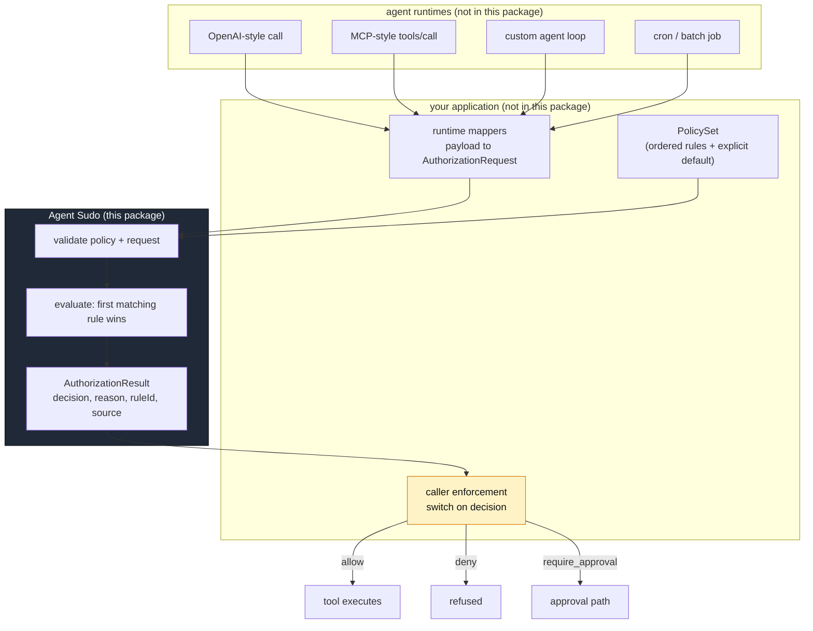
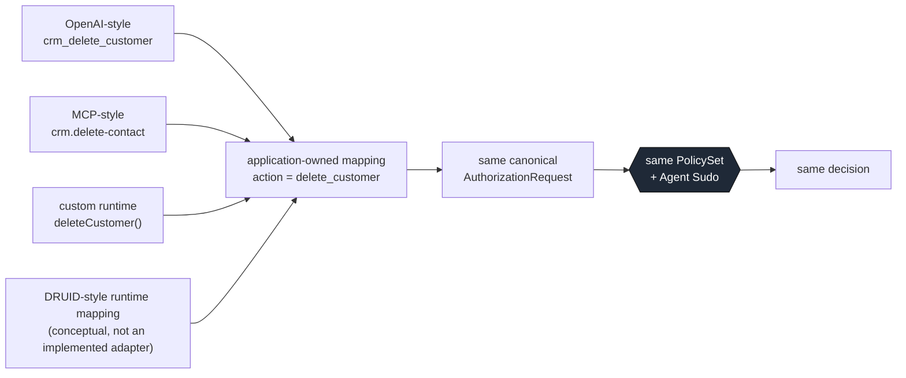
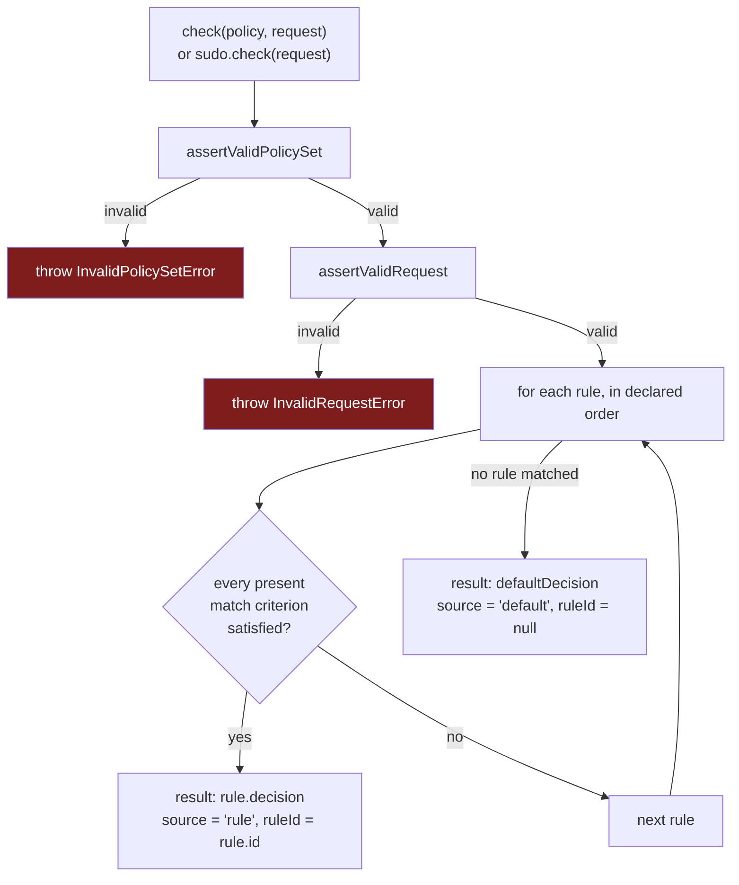
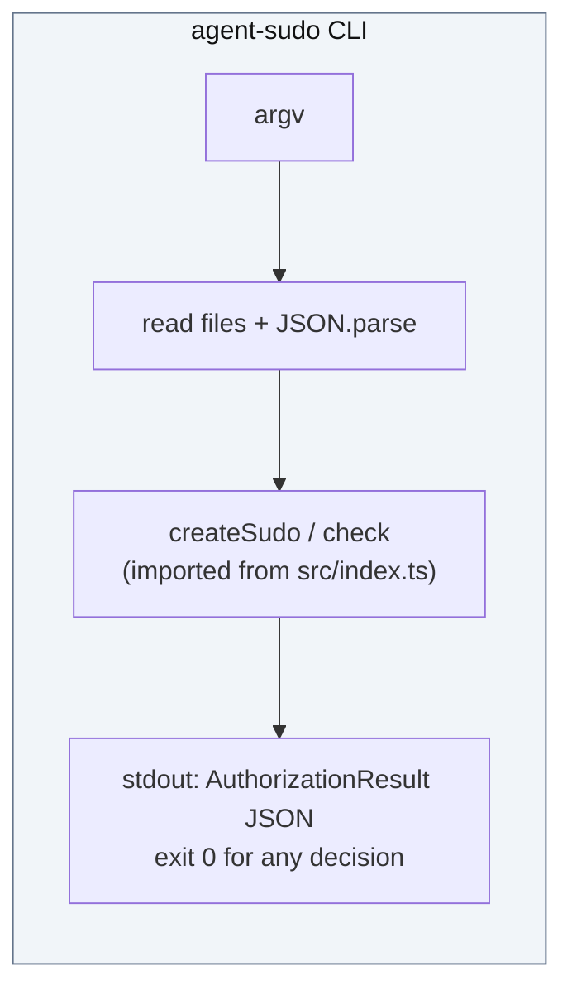

# Architecture

Agent Sudo is a single-responsibility library: **given an `AuthorizationRequest`
and a `PolicySet`, return an `AuthorizationResult`.** Everything else — mapping
runtime payloads, enforcing the decision, running tools, orchestrating
approvals — lives outside the package, in code you own.

## Responsibilities and boundaries

| Layer | Owns | Ships in this package |
| --- | --- | --- |
| Agent / runtime | Deciding it wants to perform an action | No |
| Runtime mapper | Translating a runtime-specific payload into an `AuthorizationRequest` | No — see [`integrations.md`](./integrations.md) |
| **Agent Sudo core** (`src/engine.ts`, `src/matcher.ts`, `src/validate.ts`, `src/types.ts`, `src/errors.ts`) | Validating input, evaluating rules in order, returning a decision | **Yes** |
| `PolicySet` | The rules and the explicit default | No — it is your data |
| Caller enforcement | Acting on `allow` / `deny` / `require_approval` | No |
| Tool execution | Actually performing the action | No |
| Approval path | Handling `require_approval` | No |

The package boundary is enforced by `package.json` `exports`: only the module
surface of [`src/index.ts`](../src/index.ts) is importable. Internal helpers
(`ruleMatches`, `assertValidPolicySet`, `assertValidRequest`) and the CLI entry
point are not reachable from `ai-agent-sudo/...` deep paths.

## A. Overall architecture

Agent Sudo receives **data only**. It is never handed the tool, the runtime
object, or a callback, so it cannot execute anything even by accident.

## B. Cross-runtime architecture

Different runtimes name the same operation differently. Normalizing that is
per-application work, so it lives in per-application mapper code — not in the
authorization core.

"DRUID-style" here means *a conceptual runtime whose payloads you would map the
same way* — there is no implemented or official DRUID adapter, and none is
planned. The point of the diagram is that **any** runtime reduces to the same
canonical request, after which one policy and one engine decide.

The runnable proof of this for the OpenAI-style and MCP-style shapes is
[`examples/cross-runtime/`](../examples/cross-runtime/) (`npm run
example:cross-runtime`).

## C. Internal decision flow

`createSudo(policy)` runs `assertValidPolicySet` and then `structuredClone`s the
policy once. Subsequent `sudo.check(request)` calls validate only the request and
evaluate against the private snapshot, so mutating the original policy object
after binding cannot change how that `Sudo` decides.

## The CLI is just another caller

[`src/cli.ts`](../src/cli.ts) is a thin wrapper: it reads JSON files, calls the
**same** `createSudo` / `check` from `src/index.ts`, and prints the result. It
contains no matching or validation logic of its own, so `agent-sudo check` and a
programmatic `check(policy, request)` are identical by construction.

## Design constraints

- **Zero network.** No `fetch`, no sockets, no DNS. An authorization decision is
  a pure function of its inputs.
- **Zero runtime dependencies.** The entire engine is a few hundred lines of
  standard TypeScript.
- **Synchronous-capable.** `check` returns a value, not a promise. It can run on
  the hot path immediately before a tool call.
- **JSON-shaped throughout.** Requests, policies, and results are all
  JSON-compatible, so they can cross a process or API boundary later without a
  redesign.
