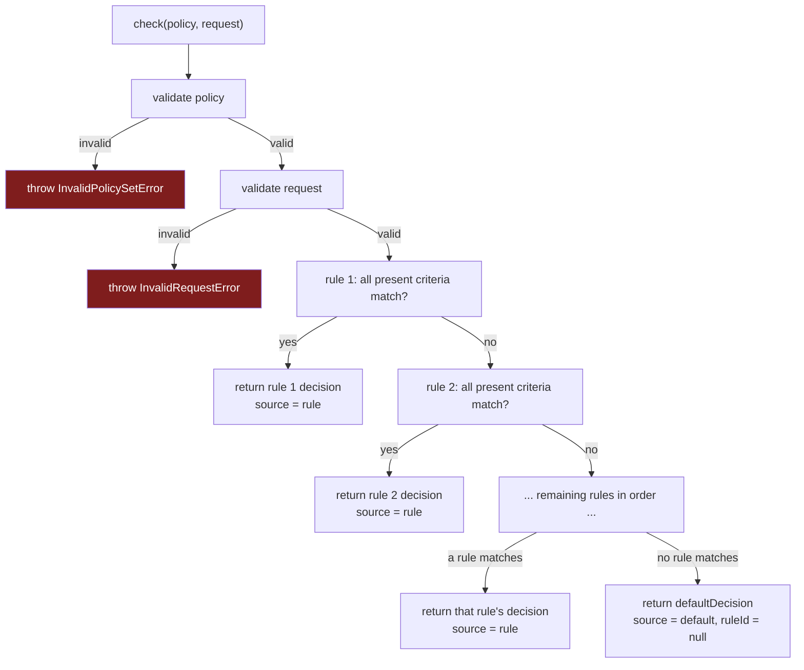

# Authorization model

This is the precise reference for what Agent Sudo evaluates and how. It matches
the types in [`src/types.ts`](../src/types.ts) and the behaviour in
[`src/matcher.ts`](../src/matcher.ts) / [`src/validate.ts`](../src/validate.ts)
exactly. Nothing here is configurable.

## AuthorizationRequest

```ts
interface AuthorizationRequest {
  actor: { id: string };                     // required
  action: { name: string };                  // required
  resource?: { type?: string; id?: string }; // optional
  context?: Record<string, JsonValue>;       // optional
}
```

- **`actor.id`** — a non-empty string. Who is attempting the action. This is
  *data*; Agent Sudo does not authenticate it (see [`security.md`](./security.md)).
- **`action.name`** — a non-empty string. What is being attempted. The vocabulary
  is owned by your application (see
  [`integration-contract.md`](./integration-contract.md)).
- **`resource`** — optional. When present, `type` and `id` must be strings if
  given.
- **`context`** — optional. Must be a plain JSON-compatible object: values may be
  string, number, boolean, `null`, arrays of those, or nested plain objects of
  those. Functions, `undefined`, `NaN`/`Infinity`, `bigint`, symbols, and class
  instances (`Date`, `Map`, …) are rejected.

Unknown extra top-level properties are **allowed and ignored** — different
runtimes carry different baggage. But any field Agent Sudo understands must be
well-formed when present, or the whole request is rejected with
`InvalidRequestError`. A malformed known field never silently causes a
restrictive rule to miss.

## AuthorizationResult

```ts
interface AuthorizationResult {
  decision: "allow" | "deny" | "require_approval";
  reason: string;
  ruleId: string | null;
  source: "rule" | "default";
}
```

- **`source: "rule"`** — a rule matched. `ruleId` is that rule's `id`, `reason`
  is that rule's `reason`.
- **`source: "default"`** — no rule matched. `ruleId` is `null`, `reason` is the
  policy set's `defaultReason`.

The result is always fully explainable — you can tell exactly what decided.

## PolicySet

```ts
interface PolicySet {
  rules: Rule[];
  defaultDecision: "allow" | "deny" | "require_approval"; // required
  defaultReason: string;                                  // required, non-empty
}
```

There is **no implicit allow.** A `PolicySet` without an explicit
`defaultDecision` / `defaultReason` is invalid and throws — it is not treated as
permissive.

## Rule

```ts
interface Rule {
  id: string;        // non-empty, unique within the set
  match: RuleMatch;  // {} matches every request
  decision: "allow" | "deny" | "require_approval";
  reason: string;    // non-empty, human-readable
}
```

Duplicate `id`s in one set are a validation error.

## RuleMatch

```ts
interface RuleMatch {
  actorId?: string | string[];
  action?: string | string[];
  resourceType?: string | string[];
  resourceId?: string | string[];
  context?: Record<string, Prim | Prim[]>; // Prim = string | number | boolean | null
}
```

Matching rules:

| Situation | Result |
| --- | --- |
| Criterion **absent** from `match` | Wildcard — always satisfied |
| `match: {}` | Matches **every** request |
| Multiple criteria present | **All** must be satisfied (logical AND) |
| String criterion vs request value | **Exact, case-sensitive** equality |
| Array criterion (`["a", "b"]`) | Satisfied if the request value is **any of** the listed values |
| `resourceType` / `resourceId` criterion, request has **no `resource`** (or no such field) | **Not satisfied** — rule is skipped |
| `context` criterion key, request has **no `context`** or the key is absent | **Not satisfied** — rule is skipped |
| `context` criterion value | Request context value must be `===`-equal to the expected primitive (or one of the expected array) |

There is **no** regex, glob, prefix, numeric comparison, negation, or nested
boolean logic. If you need "any of", use an array. Anything more expressive
belongs in your mapper or in how you structure rules.

## Precedence

- Rules are evaluated **in declared order.**
- **The first matching rule wins.** Its decision is returned immediately;
  later rules are not consulted.
- There is **no specificity scoring** and **no implicit effect precedence** (a
  `deny` does not automatically beat an `allow` — order does).
- If no rule matches, the **explicit default** is returned.

Because order is the only precedence mechanism, **rule order is
security-relevant**. Place narrow denials before broad allows.

```ts
// WRONG — allow-reads shadows deny-secrets for secret files
rules: [
  { id: "allow-reads",  match: { action: "read_file" },     decision: "allow", reason: "..." },
  { id: "deny-secrets", match: { resourceType: "secret" },  decision: "deny",  reason: "..." },
]

// RIGHT — the denial is reached first
rules: [
  { id: "deny-secrets", match: { resourceType: "secret" },  decision: "deny",  reason: "..." },
  { id: "allow-reads",  match: { action: "read_file" },     decision: "allow", reason: "..." },
]
```

## Decision flow



## Malformed input behaviour

| Input | Behaviour |
| --- | --- |
| Policy is not an object / missing default / bad default value | `InvalidPolicySetError` |
| `rules` not an array | `InvalidPolicySetError` |
| Rule with empty/duplicate `id`, bad `decision`, empty `reason`, non-object `match`, unknown `match` key, wrong `match` value type | `InvalidPolicySetError` |
| Request not an object / missing `actor.id` / missing `action.name` | `InvalidRequestError` |
| Request `resource` / `context` present but malformed | `InvalidRequestError` |

Errors are thrown, not returned. Agent Sudo never downgrades a validation failure
into a decision, and never fails open — even when `defaultDecision` is `allow`.
