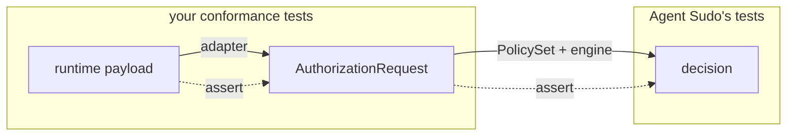

# The Agent Sudo integration contract

Agent Sudo evaluates one fixed shape — the **canonical authorization request**:

```jsonc
{
  "actor":    { "id": "..." },          // who is attempting the action
  "action":   { "name": "..." },        // what they are attempting
  "resource": { "type": "...", "id": "..." },  // optional: the target
  "context":  { "env": "...", "...": "..." }   // optional: ambient facts
}
```

Every runtime — an OpenAI-style tool call, an MCP `tools/call` message, a cron
job, your own application code — must produce this shape before Agent Sudo can
decide anything.

## Who owns what

| Concern | Owner | Example |
| --- | --- | --- |
| The request **contract** (`actor`/`action`/`resource`/`context`) | Agent Sudo | fixed, documented above |
| The **vocabulary** inside it — which `action.name` values exist, which `context` keys matter | **Your application** | `read_customer`, `delete_customer`, `send_email`; `env`, `recipient_scope` |
| Mapping a specific runtime's payload **into** that vocabulary | **The runtime adapter you write** | `crm.get-customer` → `read_customer` |
| The decision for a given request | The shared `PolicySet` | first matching rule wins |

The CRM vocabulary used throughout the examples (`read_customer`, `env`,
`recipient_scope`, …) is **an example owned by that example application**. It is
not a standard, and Agent Sudo ships no registry of canonical action names.

## Why Agent Sudo does not normalize provider terminology

Slice 3 showed two runtimes naming the same operation differently:

```
crm_lookup_customer   (OpenAI-style function name)
crm.get-customer      (MCP-style tool name)
        ↓  adapter mapping  ↓
read_customer         (your application's vocabulary)
```

```
recipient_type    (OpenAI-style argument key)
recipientScope    (MCP-style argument key)
        ↓  adapter mapping  ↓
recipient_scope   (your application's context key)
```

If Agent Sudo tried to reconcile these itself it would need built-in knowledge
of every provider's naming, argument encoding and versioning — exactly the
coupling this project exists to avoid. Normalization is a per-application
concern, so it lives in per-application adapter code that you can read, test and
change without touching the authorization core.

## Mapper responsibility

A runtime adapter is a pure function:

```
runtime-specific payload  +  ambient facts  →  AuthorizationRequest
```

It must not call Agent Sudo, must not embed policy decisions, and must not have
side effects. See
[`examples/cross-runtime/openai-style.ts`](../examples/cross-runtime/openai-style.ts)
and [`examples/cross-runtime/mcp-style.ts`](../examples/cross-runtime/mcp-style.ts)
for two worked examples.

## Mapper conformance testing

Because normalization lives in your code, **test it in your code**. A
conformance test pins a runtime payload to the exact `AuthorizationRequest` it
should produce:

```ts
import assert from "node:assert/strict";
import { test } from "node:test";
import { openAiToolCallToRequest } from "./openai-style.ts";

test("openai crm_delete_customer → delete_customer", () => {
  const actual = openAiToolCallToRequest(
    {
      id: "call_1",
      type: "function",
      function: {
        name: "crm_delete_customer",
        arguments: JSON.stringify({ customer_id: "cus_100" }),
      },
    },
    { agentId: "assistant-7", env: "production" },
  );

  assert.deepEqual(actual, {
    actor: { id: "assistant-7" },
    action: { name: "delete_customer" },
    resource: { type: "customer", id: "cus_100" },
    context: { env: "production", runtime: "openai-style" },
  });
});
```

Two independent responsibilities, two independent test suites:



- **Conformance tests** verify *mapping*: the right payload becomes the right
  `AuthorizationRequest`.
- **Agent Sudo's own tests** verify *authorization*: a given
  `AuthorizationRequest` and `PolicySet` produce a given `AuthorizationResult`.

Keep them separate. Agent Sudo has no "conformance engine" and needs none — a
conformance test is just `assert.deepEqual` on the output of your mapper.
