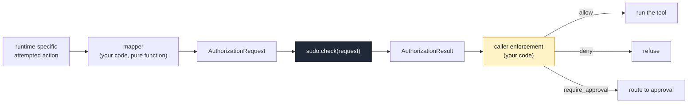

# Integrations

Agent Sudo does not integrate with any runtime directly. Instead, every runtime
follows the same pattern: a small **mapper you own** turns that runtime's
attempted action into an `AuthorizationRequest`, and the caller acts on the
result.



## What a mapper is

A mapper is a **pure function**:

```
runtime-specific payload  +  ambient facts (identity, env)  ->  AuthorizationRequest
```

It must:

- **not** call Agent Sudo,
- **not** embed policy decisions,
- **not** have side effects,
- **not** execute or receive the tool.

It only rewrites data into the canonical shape. Keeping it pure is what makes it
cheap to unit-test in isolation (see
[conformance testing](./integration-contract.md#mapper-conformance-testing)).

## Worked examples in this repository

| Example | What it shows | Runnable |
| --- | --- | --- |
| [`examples/protect-tool-call.ts`](../examples/protect-tool-call.ts) | Agent Sudo in front of ordinary application actions; the caller's `switch` invokes a fake tool only on `allow` | `npm run example` |
| [`examples/cross-runtime/`](../examples/cross-runtime/) | The same four actions expressed as OpenAI-style and MCP-style envelopes, mapped by separate mappers, evaluated against one shared `PolicySet`, asserted equivalent | `npm run example:cross-runtime` |
| [`examples/policy-files/`](../examples/policy-files/) | A JSON `PolicySet` plus four request files, used with the `agent-sudo` CLI | `agent-sudo check examples/policy-files/crm-policy.json examples/policy-files/requests/read-customer.json` |

### OpenAI-style and MCP-style examples

[`examples/cross-runtime/openai-style.ts`](../examples/cross-runtime/openai-style.ts)
and
[`examples/cross-runtime/mcp-style.ts`](../examples/cross-runtime/mcp-style.ts)
model *just enough* of each envelope shape to show the mapping:

- **OpenAI-style** — the tool name is at `function.name`; `function.arguments` is
  a JSON-encoded string that must be parsed; argument keys are flat snake_case;
  the envelope carries no caller identity, so the runtime supplies it.
- **MCP-style** — a JSON-RPC envelope with `method: "tools/call"`; the tool name
  is at `params.name` (dotted / kebab-case); `params.arguments` is already a
  structured object; argument keys are camelCase; identity is the connected
  client.

> These are **integration-shape examples**, not official or certified adapters.
> They pull in **no** provider SDKs (`openai`, `@modelcontextprotocol/sdk`, …).
> Agent Sudo has no plan to ship official provider adapters — provider payload
> handling is exactly the coupling this project exists to keep out of the core.

## A minimal custom-runtime mapper

Your own agent loop probably has a much simpler shape. The mapper is
correspondingly small:

```ts
import { createSudo } from "ai-agent-sudo";
import type { AuthorizationRequest, PolicySet } from "ai-agent-sudo";

// --- your runtime's attempted-action shape ---------------------------------
interface AgentAction {
  agentId: string;
  tool: string;                       // e.g. "db.deleteRow"
  args: Record<string, unknown>;
  env: "development" | "staging" | "production";
}

// --- your application's vocabulary ----------------------------------------
const TOOL_TO_ACTION: Record<string, string> = {
  "db.readRow": "read_record",
  "db.deleteRow": "delete_record",
  "email.send": "send_email",
};

// --- the mapper: pure, no Agent Sudo, no policy --------------------------
export function agentActionToRequest(a: AgentAction): AuthorizationRequest {
  const action = TOOL_TO_ACTION[a.tool] ?? a.tool;
  const request: AuthorizationRequest = {
    actor: { id: a.agentId },
    action: { name: action },
    context: { env: a.env, runtime: "custom" },
  };
  if (typeof a.args["table"] === "string") {
    request.resource = { type: "table", id: a.args["table"] };
  }
  return request;
}

// --- wiring it up (this part is not the mapper) -------------------------
const policy: PolicySet = {
  rules: [
    { id: "deny-deletes", match: { action: "delete_record" },
      decision: "deny", reason: "agents may not delete records" },
    { id: "approve-prod-email",
      match: { action: "send_email", context: { env: "production" } },
      decision: "require_approval", reason: "prod email needs a human" },
  ],
  defaultDecision: "deny",
  defaultReason: "no rule permitted this action",
};
const sudo = createSudo(policy);

export function runGuarded(a: AgentAction, invoke: () => unknown) {
  const { decision, reason, ruleId } = sudo.check(agentActionToRequest(a));
  if (decision === "allow") return invoke();
  if (decision === "deny") throw new Error(`denied by ${ruleId ?? "default"}: ${reason}`);
  return { status: "pending_approval" as const, reason, ruleId };
}
```

Do not add provider-specific integration code to *this repository* to document a
runtime — write the mapper in your own codebase and unit-test it there. The
repository's job is to specify the contract, not to accumulate adapters.
