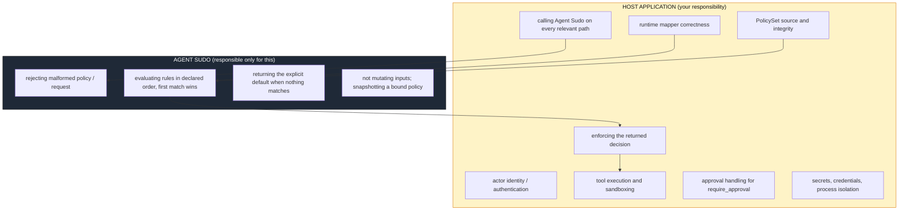

# Security model & trust boundary

Agent Sudo is a small, deterministic **authorization decision engine**. This
document states plainly what that does and does not give you, so you can reason
about where it fits in your threat model.

For how to report a vulnerability, see
[`SECURITY.md`](../SECURITY.md).

## The one-sentence version

Agent Sudo tells you whether an action *should* be allowed; **your code is
responsible for making sure the action cannot happen unless Agent Sudo allowed
it.**

## Trust boundary

## What Agent Sudo does

- **Rejects malformed input.** A structurally invalid `PolicySet` throws
  `InvalidPolicySetError`; an invalid `AuthorizationRequest` throws
  `InvalidRequestError`. It never treats "I could not understand this" as
  "allow". This holds even when `defaultDecision` is `allow`.
- **Requires an explicit default.** There is no implicit allow. A policy with no
  `defaultDecision` is invalid, not permissive.
- **Evaluates deterministically.** Same policy + same request → same result. No
  randomness, no time dependence, no I/O, no LLM.
- **Does not upgrade decisions.** `require_approval` is never rewritten to
  `allow`.
- **Does not mutate your objects.** `createSudo` deep-clones the validated policy;
  later mutation of the object you passed in cannot change how that `Sudo`
  instance decides. `check(policy, request)` reads but does not modify its
  arguments.
- **Stays in-process.** No network, no filesystem (the library itself; the CLI
  reads the files you name), no telemetry.

## What Agent Sudo does NOT do

- **It does not enforce anything.** It returns a value. If your code proceeds to
  run the tool regardless of a `deny`, the tool runs. Every code path that can
  perform a sensitive action must consult Agent Sudo *and act on the result*.
- **It does not authenticate identity.** `actor.id` is a string you supply.
  Agent Sudo does not verify that the caller is really that actor. Authenticate
  upstream; pass a trustworthy `actor.id`.
- **It does not guarantee policy integrity.** If an attacker can modify the
  `PolicySet` your application loads, they control the decisions. Treat policy
  files as code: review them, keep them in version control, restrict write
  access.
- **It does not guarantee mapper integrity.** If your runtime mapper produces the
  wrong `action.name` or drops a `context` key, Agent Sudo faithfully evaluates
  the wrong request. Test your mappers (see
  [`integration-contract.md`](./integration-contract.md#mapper-conformance-testing)).
- **It does not manage secrets or credentials.**
- **It does not isolate or sandbox processes.**
- **It does not execute tools.** It is never handed an executable function.
- **It does not orchestrate approvals.** `require_approval` is a signal to *your*
  system to stop and route elsewhere; Agent Sudo has no queue, no UI, no
  callback.

## Security-relevant properties to review

- **Rule order.** First match wins, with no specificity scoring. A broad `allow`
  placed before a narrow `deny` will shadow it. Order narrow denials first and
  review policy diffs for reordering.
- **Wildcards.** An absent `match` criterion is a wildcard, and `match: {}`
  matches every request. A rule that is more permissive than intended is usually
  a missing criterion.
- **`resource` / `context` absence.** A `resourceType` or `context` criterion
  does **not** match a request that lacks that field — the rule is skipped, and
  evaluation continues. If a protective rule depends on a `context` key, make
  sure your mapper always sets it, or add a catch rule.
- **Unknown actions.** An `action.name` that no rule matches reaches the explicit
  default. For a fail-safe posture, use `defaultDecision: "deny"` (as every
  bundled example does).
- **The default itself.** `defaultDecision: "allow"` means every unmatched action
  is permitted. Choose it only deliberately.

## Reporting a vulnerability

See [`SECURITY.md`](../SECURITY.md) in the repository root.
